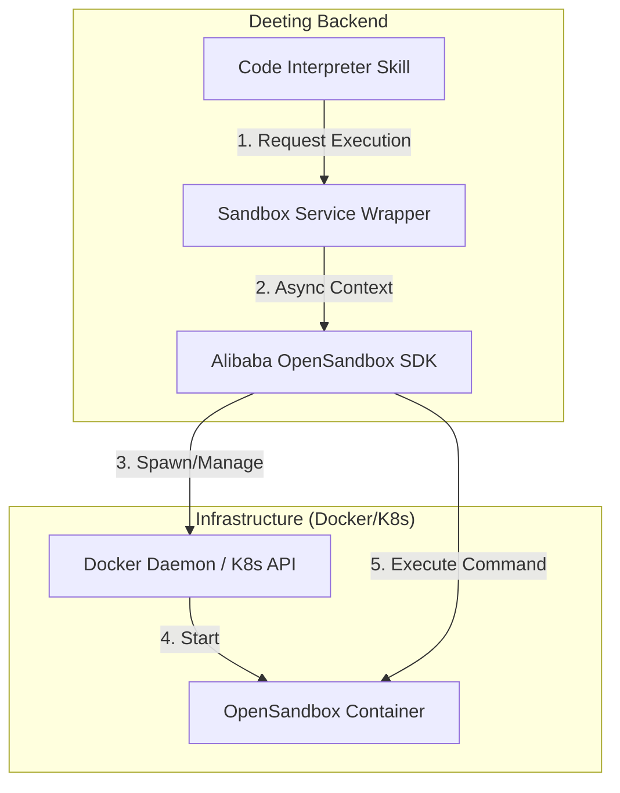

# OpenSandbox Integration Design (Powered by Alibaba OpenSandbox)

## 1. Introduction
This document outlines the integration of **Alibaba OpenSandbox** into Deeting OS.
We will leverage the official `opensandbox` Python SDK to manage secure, isolated execution environments for AI Agents.

**Reference**: [Alibaba OpenSandbox GitHub](https://github.com/alibaba/OpenSandbox)

## 2. Architecture

### 2.1 System Topology


### 2.2 Key Components
1.  **Sandbox Manager Service**: Wraps the `opensandbox` SDK to provide a high-level API for Skills (e.g., `execute_code(session_id, code)`).
2.  **OpenSandbox SDK**: The official Python library (`pip install opensandbox`) handling the low-level protocol.
3.  **Runtime Images**: Official images (e.g., `opensandbox/code-interpreter:v1.0.1`) or custom extensions.

## 3. Implementation Details

### 3.1 Dependencies
*   **Package**: `opensandbox`
*   **System**: Docker Engine (local development) or Kubernetes (production).

### 3.1.1 Runtime Configuration（已支持）
- `OPENSANDBOX_URL`
- `OPENSANDBOX_IMAGE`
- `OPENSANDBOX_ENTRYPOINT`
- `OPENSANDBOX_PYTHON_VERSION`
- `OPENSANDBOX_RESOURCE_CPU`
- `OPENSANDBOX_RESOURCE_MEMORY`
- `OPENSANDBOX_NETWORK_POLICY_JSON`（可选，原样透传 SDK）

### 3.2 Service Design (`backend/app/core/sandbox/service.py`)

The service will implement a Singleton pattern to manage active sandboxes mapped to user sessions.

```python
from opensandbox import Sandbox
from datetime import timedelta

class SandboxService:
    async def run_code(self, session_id: str, code: str, language: str = "python"):
        # Configuration
        image = "opensandbox/code-interpreter:v1.0.1"
        
        # Initialize Sandbox (connects to Docker/K8s)
        # Note: In a real app, we might keep the sandbox alive across requests
        # using a persistent manager. For MVP, we might use ephemeral.
        async with Sandbox.create(image, timeout=timedelta(minutes=5)) as sandbox:
            
            # 1. Write Code to File
            await sandbox.fs.write("/tmp/script.py", code)
            
            # 2. Execute
            # The official image likely has a specific entrypoint or we call python directly
            result = await sandbox.exec(["python3", "/tmp/script.py"])
            
            return {
                "stdout": result.stdout,
                "stderr": result.stderr,
                "exit_code": result.exit_code
            }
```

### 3.3 Skill Implementation (`backend/app/agent_plugins/builtins/code_interpreter/plugin.py`)

The Skill serves as the interface between the LLM and the Sandbox Service.

**Tool Definition**:
```yaml
name: code_interpreter
description: Execute Python code in a secure sandbox.
parameters:
  code: string
```

**Workflow**:
1.  LLM generates Python code.
2.  Skill calls `SandboxService.run_code(session_id, code)`，并在提交代码前注入运行时上下文：
   - `RUNTIME_CONTEXT`（user/session/tenant、trace、auth scopes、路由摘要、execution meta）
   - `RUNTIME_CONTEXT.bridge`（bridge endpoint + execution_token + timeout）
   - `TOOL_PLAN_RESULTS`（如使用了声明式 `tool_plan` 预取）
   - `deeting_sdk.pyi/.py`（按当前可用工具动态生成，模块名 `deeting_sdk`）
3.  若代码内调用 `deeting.call_tool(...)`：
   - 优先走 HTTP Bridge 回调宿主 (`/api/v1/internal/bridge/call`)
   - Bridge 会校验 execution token（TTL、原子调用次数、scope/model 权限）
   - Bridge 失败时回退到 marker 请求，服务端执行真实工具后将结果写入 `RUNTIME_TOOL_RESULTS` 并重跑脚本
4.  若代码内调用 `deeting.render(view_type, payload, ...)`：
   - Runtime 输出 render marker，由宿主解析为 `ui.blocks`
   - 执行结果会附带 `runtime.render_blocks` 供可观测与调试回放
5.  Service spawns/reuses sandbox, executes code, returns output.
6.  Skill formats output (truncating long logs) and returns to LLM.

## 4. Phase 1 Implementation Plan

1.  **Install SDK**: Add `opensandbox` to `pyproject.toml`.
2.  **Pull Image**: `docker pull opensandbox/code-interpreter:v1.0.1` (or latest).
3.  **Core Module**: Create `backend/app/core/sandbox/` with the service wrapper.
4.  **Test**: Create a script `backend/scripts/test_opensandbox.py` to verify Docker connectivity and basic execution.

## 5. Security & Constraints
*   **Network**: The official `opensandbox` allows configuring network policies. We should default to **offline** or **whitelist-only**.
*   **Resource Limits**: Set CPU/Mem limits via the SDK's creation parameters.
*   **Timeouts**: Enforce strict timeouts (e.g., 30s execution, 10m session).

## 6. Comparison with previous design
*   **Pros**: Uses a battle-tested library, standardizes the protocol, supports K8s out-of-the-box.
*   **Cons**: Dependency on external library updates.

This design aligns with the "Open Source First" philosophy of Deeting OS.
